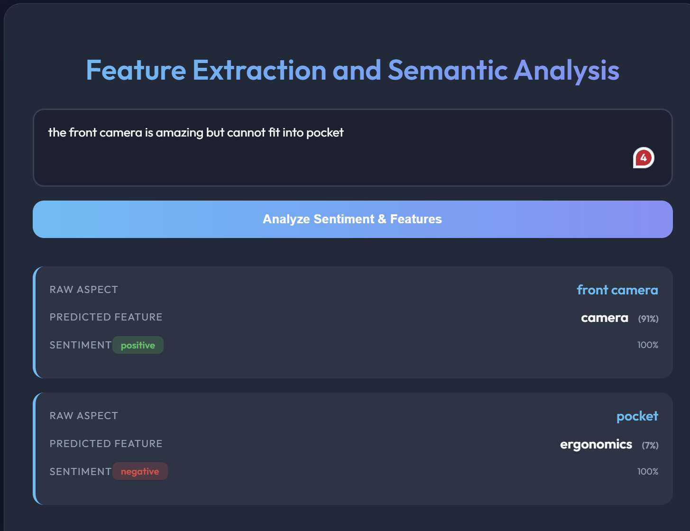
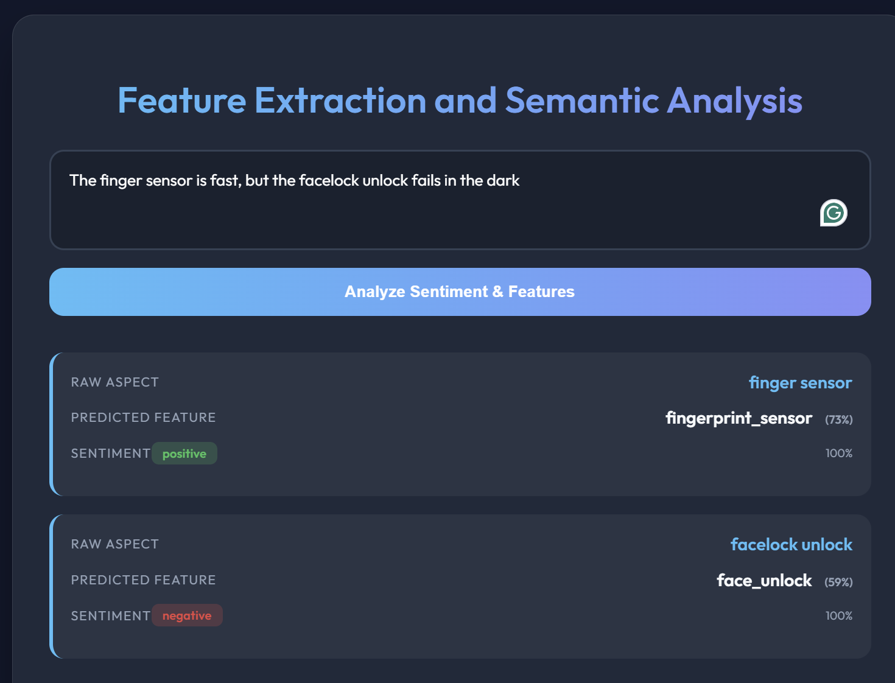
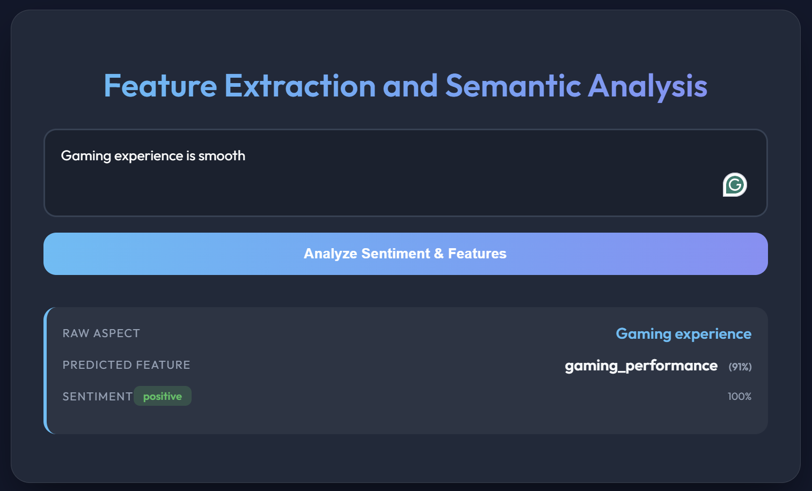
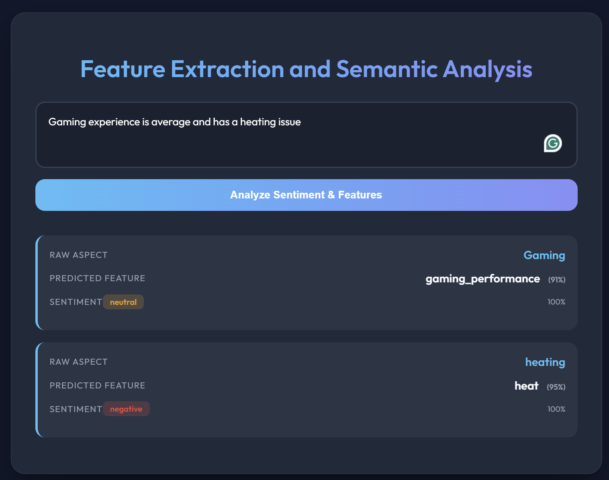
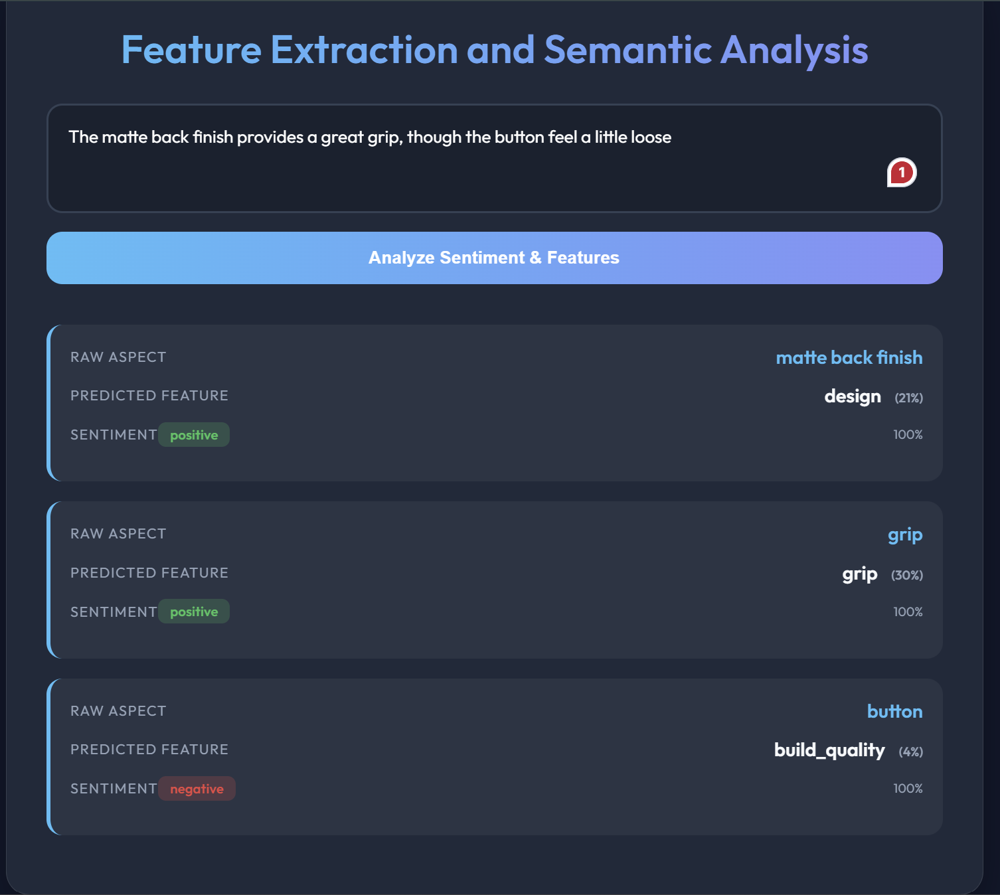
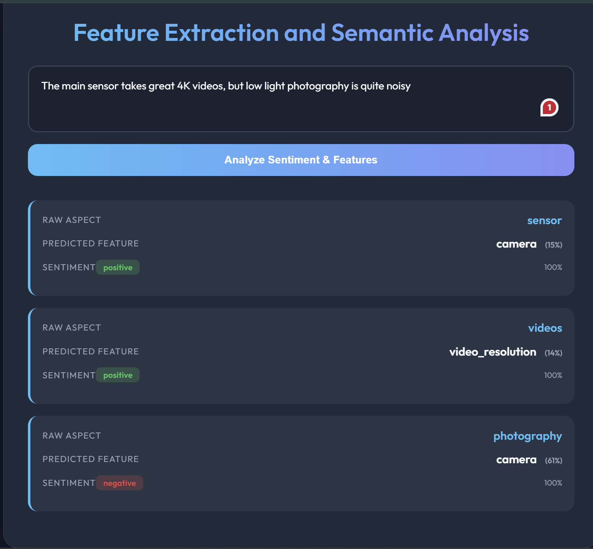
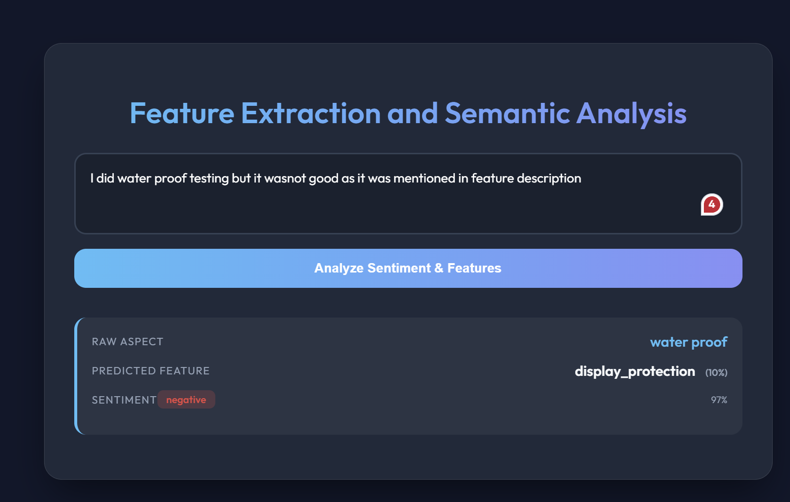
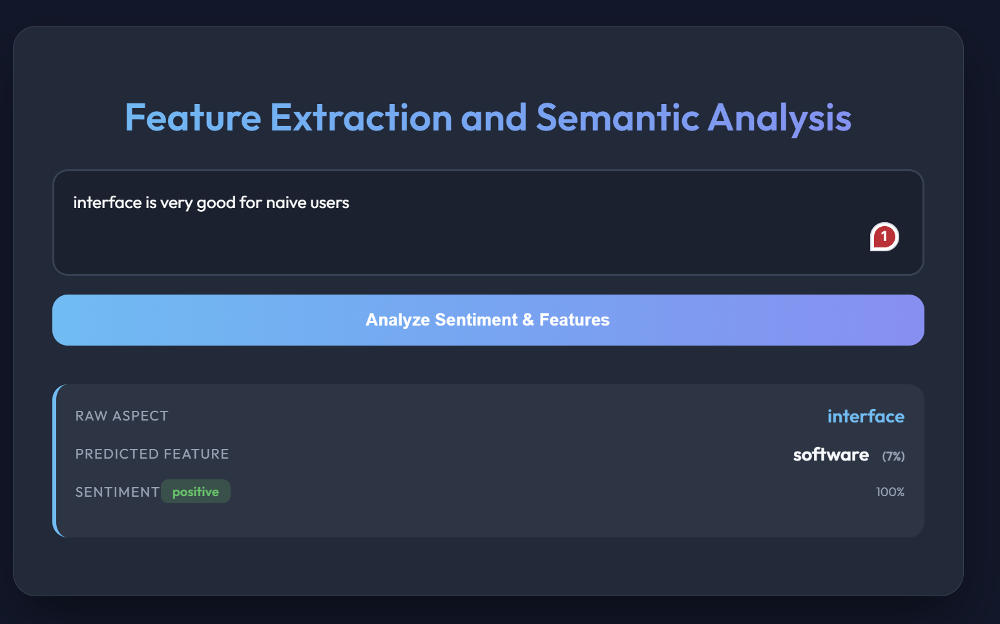
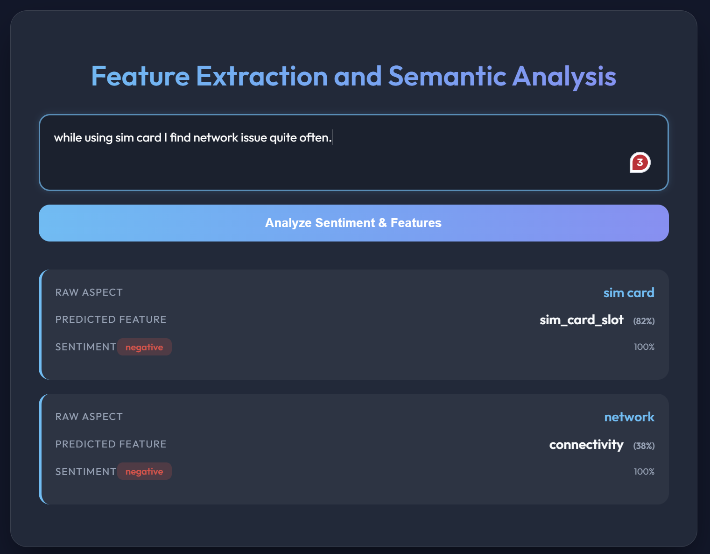

# Custom Feature Semantic Extraction using BERT Architecture

**Note:** This README mainly describes the techniques used under the `custom_feature_semantic_extraction` directory.

This project is an attempt to understand product reviews in a more structured and meaningful way using transformer-based models. Instead of treating a review as a single block of text, the system tries to break it down into **features (aspects)** and analyze sentiment for each feature separately.

The main idea is simple:

> understand *what* the user is talking about and *how* they feel about it.

---

## Motivation

In real-world product reviews, users rarely use consistent wording.

For example:
- "battery backup"
- "battery life"
- "battery power"

All of these refer to the same concept, but they are written differently. A naive system would treat them as separate things. That creates inconsistency and makes analysis harder.

So the goal here is:
- extract raw aspects from text
- map them into a **fixed canonical feature space**
- analyze sentiment for each feature

---
So here I have tried to build an pipeline to do so but with limited dataset during training becasue of hardware limitations. Here I have built a detailed pipeline for it.

## Overall Approach

The system is built as a pipeline:

Review Sentence 
→ Aspect Extraction 
→ Feature Mapping (BERT) 
→ Sentiment Prediction (BERT)

Instead of solving everything in one step, the pipeline is divided into smaller controlled steps.

---

## Dataset Creation (How data was built)

I did not use a ready dataset. I created the dataset manually using a combination of preprocessing + LLM.
At first only a small domain dataset is taken for a reference which is electronic dataset for a mobilephone.

### Step 1 → Raw Data
Started from: `electronics_reviews_uniq.json`
Contains: product, category, rating, review_title, description.

### Step 2 → Cleaning
- removed null values
- kept useful columns
- removed empty reviews
Output: `clean_reviews.csv`

### Step 3 → Sentence Splitting
- split reviews into sentences
- cleaned punctuation
- removed short sentences 
Output: `sentence_reviews.csv`

### Step 4 → LLM-based Label Generation
Model used: **Gemini 2.5 Flash Lite**
Used **zero-shot prompting** to generate raw_aspect, canonical_feature, and sentiment. this is done inorder to create a good labeled dataset quickly for now. This appraoch can be improved when it is done further

### Step 5 → Dynamic Canonicalization
To solve inconsistent naming, I maintained a feature memory to reuse existing features and avoid duplicates.
Final dataset: `aspect_semantic_dataset_canonicalized.csv`

---

## Model Architecture

Both models use the following input format:
`[CLS] aspect [SEP] sentence [SEP]`

This allows BERT to understand both the aspect and the context.

### Internal Flow
Instead of using only the CLS token, I added **attention pooling**:
1. **Tokenization:** convert text into tokens.
2. **BERT Forward:** outputs embedding for each token.
3. **Attention Layer:** each token gets importance score.
4. **Softmax:** convert scores to weights.
5. **Weighted Pooling:** combine token embeddings based on weights.
6. **Classifier:** final prediction.

### Why attention pooling?
In a sentence like "battery drains too quickly", the attention helps the model focus on the most important words like "battery", "drains", and "quickly".

---

## Models

### Feature Mapper
- **Task:** multi-class classification (~100+ features).
- **Input:** (raw_aspect, sentence).
- **Output:** canonical feature.
- **Note:** Class weights were used to handle imbalance.

### Sentiment Model
- **Task:** 3-class classification (positive, neutral, negative).
- **Input:** (raw_aspect, sentence).
- **Output:** sentiment.

---

## Training Process

Training is done using HuggingFace Trainer:
1. Load and split dataset.
2. Tokenize input and create batches.
3. Forward pass and compute CrossEntropyLoss.
4. Backpropagation and weight updates.
5. Evaluation using Accuracy and F1 score.

---

## Inference Pipeline (App)

A Flask app (`app.py`) handles the flow:
For testing/inference, PyABSA (DeBERTa-based) is used to quickly extract raw aspects, where it internally uses BIO tagging (B-I-O format) for sequence labeling but only the final extracted aspect spans are used, and then the trained BERT models are loaded and applied for feature mapping and sentiment prediction.

User input → PyABSA extracts aspects → Feature mapper predicts feature → Sentiment model predicts sentiment → Output returned.

### Example Output
Input: "The display is bright but battery drains fast"

[
  {"aspect": "display", "feature": "display", "sentiment": "positive"},
  {"aspect": "battery", "feature": "battery", "sentiment": "negative"}
]

---

## Outputs

Sample outputs of the system are stored inside the `outputs/` folder.

Below are some results from the system:

## Sample Outputs
| Left Column Results | Right Column Results |
| :---: | :---: |
|  <b>Result 1</b> |  <b>Result 2</b> |
|  <b>Result 3</b> |  <b>Result 4</b> |
|  <b>Result 5</b> |  <b>Result 6</b> |
|  <b>Result 7</b> |  <b>Result 8</b> |
|  <b>Result 9</b> | |
> **Note:** These outputs demonstrate how the pipeline works end-to-end, from aspect extraction to feature mapping and sentiment prediction.
